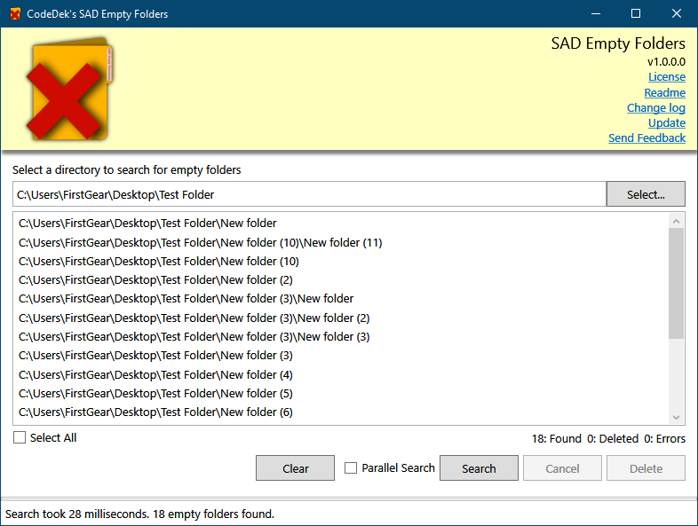

# CodeDek's SAD Empty Folders

Easily find all the empty folders in a given directory, then select and delete those of your choosing.

[**Download**](https://github.com/codedek/CodeDek.FolderSharer/releases) the latest or scroll to the [downloads](#downloads) section to check out all releases and their [Change log](#downloads).

### Copyright
© 2019 CodeDek. All Rights Reserved.

### Dependencies
- [.NET Framework 4.6.1](https://dotnet.microsoft.com/download/dotnet-framework/net461) (Required to be installed on your machine for this app to run.)

## Features
- Search any directory for empty folders
- Cherry pick from the results what to delete.
- Stop search if its taking too long.

### How To
1. Select a directory to search for empty folders.
2. [Optional] Check Parallel Search (This could speed up the search if you have an SSD and if there are many files in the directory).
3. Check Select All or cherry pick the folders that you would like to delete.
5. Click the Delete button.
6. Profit. ...and tell me if you liked the experience :).

### Submit Issues or Requests
Please submit any issues and or requests that you have [**here**](https://github.com/codedek/CodeDek.searchanddeleteemptyfolders/issues).

### Downloads
[Version 1.0](https://github.com/codedek/CodeDek.searchanddeleteemptyfolders/releases/tag/v1.0) **-** [Change log](CHANGELOG.md)